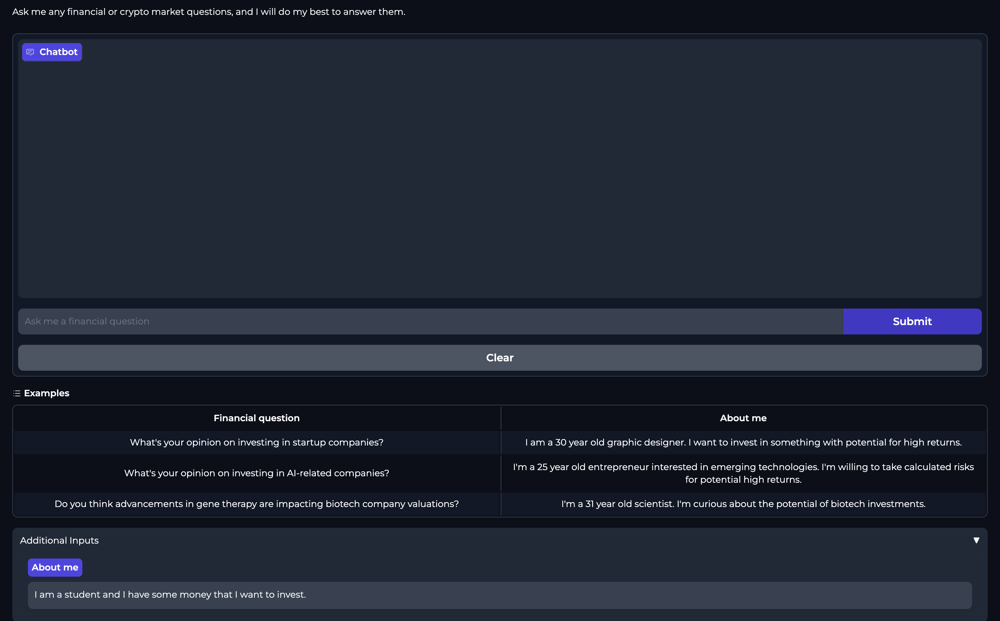
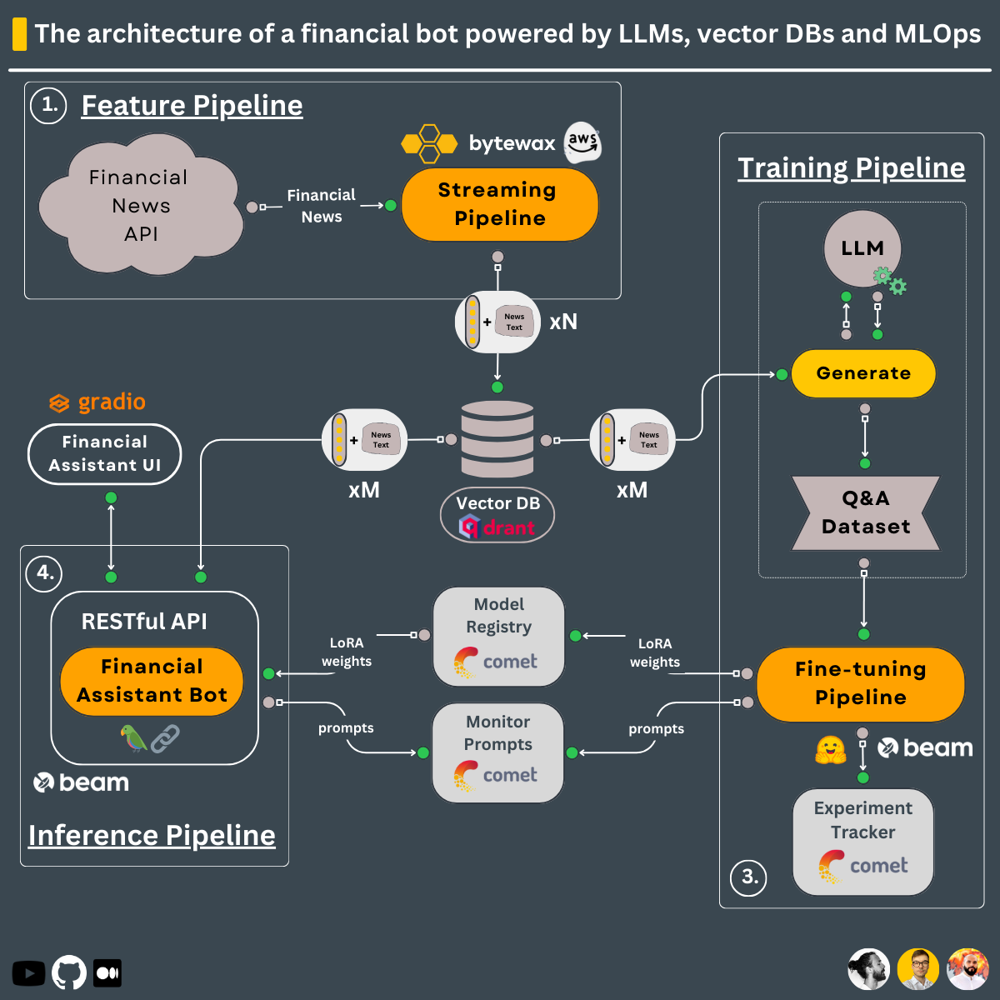

# LLM Financial Assistant — End-to-End Production Pipeline

<!-- [](https://financial-llm-assistant.onrender.com) [](https://github.com/shrihareepanchal/AI_LLM_Financial_Assistant) -->

A complete LLM system for financial advice — from real-time news ingestion and embedding, through QLoRA fine-tuning, to a deployed chatbot with RAG-augmented responses.

## Architecture

```
┌───────────────────────────────────────────────────────────────────────┐
│                        DATA LAYER                                     │
│                                                                       │
│  Alpaca News API ──► Bytewax Streaming Pipeline ──► Qdrant Vector DB │
│  (real-time news)     (clean, chunk, embed)         (embeddings)      │
│                                                                       │
│  Q&A Dataset Generator ──► Custom Training Data (JSON)                │
└──────────────────────────────┬────────────────────────────────────────┘
                               │
┌──────────────────────────────▼────────────────────────────────────────┐
│                      TRAINING LAYER                                   │
│                                                                       │
│  Base LLM ──► QLoRA Fine-Tuning ──► Comet ML (tracking + registry)   │
│               (custom finance Q&A)   Beam (serverless GPU)            │
└──────────────────────────────┬────────────────────────────────────────┘
                               │
┌──────────────────────────────▼────────────────────────────────────────┐
│                     INFERENCE LAYER                                    │
│                                                                       │
│  User Query                                                           │
│      │                                                                │
│      ▼                                                                │
│  LangChain ──► Embed Query ──► Qdrant (retrieve context)             │
│      │                              │                                 │
│      ▼                              ▼                                 │
│  Fine-Tuned LLM + Context + Chat History ──► Response                │
│                                                                       │
│  Deployed: Beam (REST API) + Gradio (UI)                             │
└───────────────────────────────────────────────────────────────────────┘
```

## Modules

| Module | Purpose | Key Tech |
|--------|---------|----------|
| [Streaming Pipeline](modules/streaming_pipeline/) | Real-time financial news ingestion & embedding | Bytewax, Qdrant, Alpaca API |
| [Q&A Dataset Generator](modules/q_and_a_dataset_generator/) | Generate fine-tuning data from financial news | OpenAI, Qdrant |
| [Training Pipeline](modules/training_pipeline/) | Fine-tune LLM with QLoRA on custom dataset | QLoRA, Comet ML, Beam |
| [Financial Bot](modules/financial_bot/) | Inference chatbot with RAG-augmented responses | LangChain, Qdrant, Gradio |
| [Dataset Analysis](dataset_analysis/) | EDA on training prompts and data quality | Pandas, Jupyter |

## Quick Start

### Prerequisites

- Python 3.10+
- [Poetry](https://python-poetry.org/) (dependency management)
- API keys: OpenAI, Comet ML, Qdrant, Alpaca (see `.env.example` in each module)

### 1. Streaming Pipeline — Ingest Financial News

```bash
cd modules/streaming_pipeline
poetry install
cp .env.example .env  # fill in Alpaca + Qdrant credentials
make run_real_time
```

### 2. Generate Training Data

```bash
cd modules/q_and_a_dataset_generator
poetry install
make generate
```

### 3. Fine-Tune the Model

```bash
cd modules/training_pipeline
poetry install
cp .env.example .env  # fill in Comet ML + Beam credentials
make train
```

### 4. Run the Financial Bot

```bash
cd modules/financial_bot
poetry install
cp .env.example .env  # fill in all credentials
make run_local       # local inference
make run_ui          # Gradio UI
```

## Tech Stack

- **LLM**: Open-source base model + QLoRA fine-tuning
- **RAG**: Qdrant vector DB + LangChain retrieval chains
- **Streaming**: Bytewax for real-time data processing
- **Training**: QLoRA (4-bit quantized LoRA), Comet ML experiment tracking
- **Deployment**: Beam (serverless GPU), Gradio (UI), GitHub Actions (CI/CD)
- **Data**: Alpaca Markets financial news API

## Project Structure

```
├── dataset_analysis/          # EDA notebooks for training data
├── media/                     # Architecture diagrams & screenshots
├── modules/
│   ├── financial_bot/         # Inference pipeline + Gradio UI
│   ├── q_and_a_dataset_generator/  # Training data generation
│   ├── streaming_pipeline/    # Real-time news → embeddings
│   └── training_pipeline/     # QLoRA fine-tuning pipeline
└── README.md
```

## Screenshots

| Financial Bot (Gradio UI) | Architecture |
|:---:|:---:|
|  |  |
